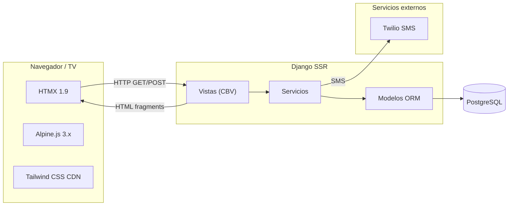
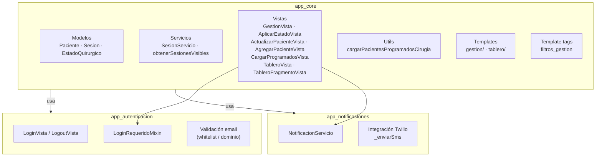
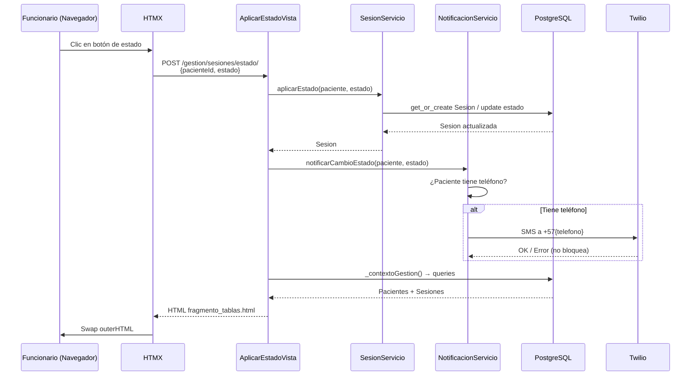
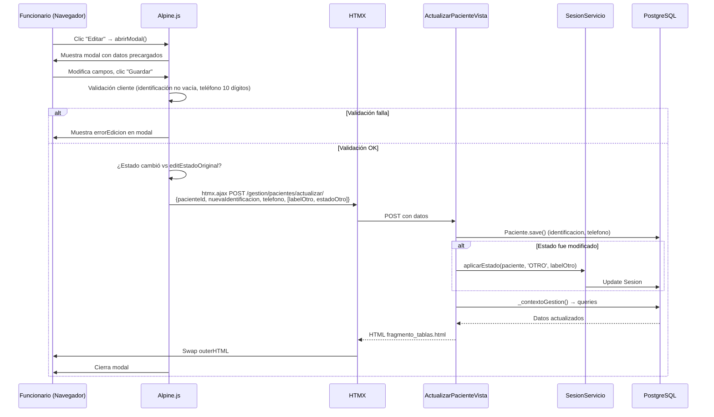
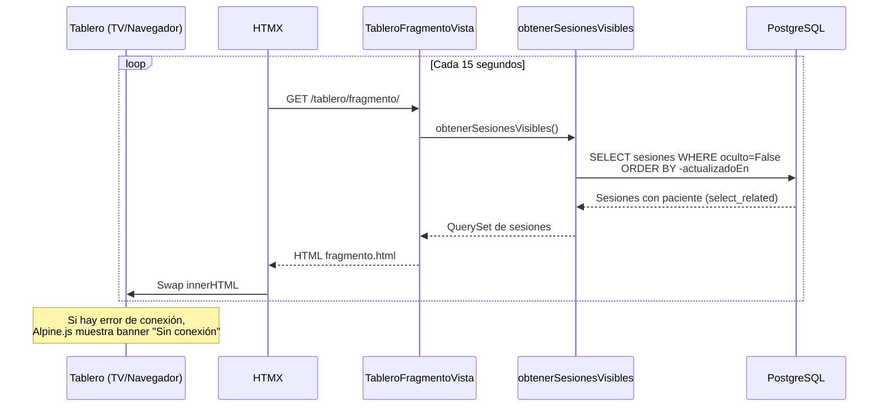
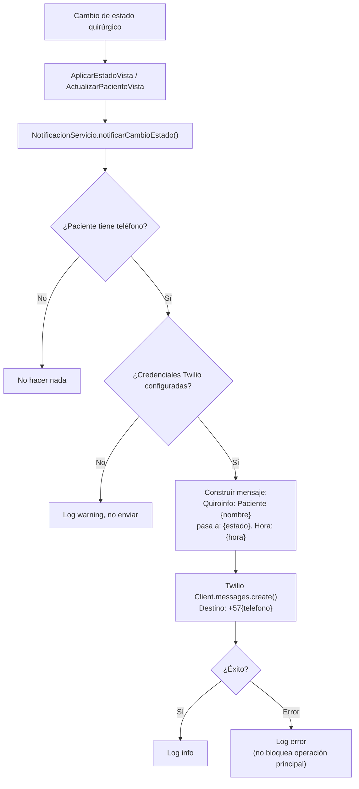

# Arquitectura — Quiroinfo

## Visión general

Quiroinfo es una aplicación web de **Server-Side Rendering (SSR)** construida con Django. No hay SPA ni API REST. Las interacciones dinámicas se manejan con HTMX (fragmentos HTML parciales) y Alpine.js (comportamientos ligeros de UI).



---

## Diagrama de componentes — Apps Django

El proyecto se compone de 3 apps Django, cada una con una responsabilidad clara:



### Responsabilidades por app

| App | Responsabilidad |
|---|---|
| `app_autenticacion` | Login/logout por email, mixin de protección de vistas, validación de whitelist/dominio |
| `app_core` | Modelos de datos, lógica de negocio (servicios), vistas del panel de gestión y tablero, templates, carga de pacientes |
| `app_notificaciones` | Envío de SMS vía Twilio ante cambios de estado quirúrgico |

---

## Flujo de datos: Cambio de estado quirúrgico

Cuando un funcionario hace clic en un botón de estado en la Tabla_Programados:



---

## Flujo de datos: Edición de paciente (Modal)

Cuando un funcionario edita un paciente desde el Modal_Edicion:



---

## Flujo de datos: Polling del tablero

El tablero público se actualiza automáticamente cada 15 segundos:



---

## Flujo de notificación SMS



---

## Flujo de renderizado de templates

```mermaid
flowchart TD
    subgraph Tablero["Tablero (público)"]
        T1["tablero.html\n(HTML completo, 100vh)"]
        T2["tablero/fragmento.html\n(lista de sesiones, flex layout)"]
        T1 -->|"include"| T2
    end

    subgraph Gestion["Panel de gestión (privado)"]
        G1["gestion.html\n(HTML completo, header + logout)"]
        G2["gestion/fragmento_tablas.html\n(grid 2 columnas: Programados + En Sala)"]
        G1 -->|"include"| G2
    end

    subgraph Base["Template base"]
        B1["templates/base.html\n(CDN: Tailwind + Alpine + HTMX)"]
    end

    subgraph Auth["Autenticación"]
        L1["autenticacion/login.html\n(formulario email, standalone)"]
    end

    Note over T1: No extiende base.html<br>(layout TV independiente)
    Note over G1: No extiende base.html<br>(incluye CDNs directamente)
    Note over L1: Standalone, solo Tailwind CDN
```

### Notas sobre templates

- **`tablero.html`** y **`gestion.html`** son páginas completas independientes que incluyen sus propios CDN scripts. No extienden `base.html`.
- **`base.html`** existe como template base disponible pero no se usa actualmente en las vistas principales.
- Los **fragmentos** (`fragmento_tablas.html`, `tablero/fragmento.html`) son parciales HTML sin `<html>/<body>`, diseñados para swap HTMX.
- El token CSRF se inyecta vía JavaScript en `gestion.html` para todas las peticiones HTMX.
- Alpine.js maneja estado local por fila (`x-data` en cada `<tr>`) en la tabla de programados.
