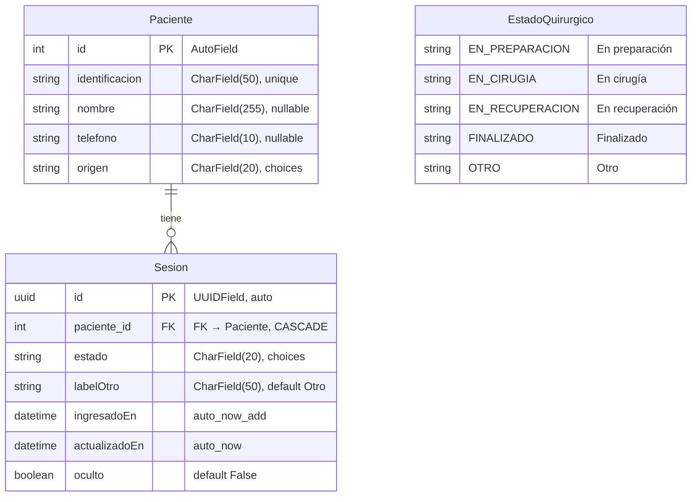

# Modelo de Datos — Quiroinfo

## Diagrama ER



---

## Modelos

### EstadoQuirurgico (Enum)

Enumeración `TextChoices` que define los estados posibles del proceso quirúrgico. No es un modelo de base de datos, sino un enum usado como `choices` en el campo `Sesion.estado`.

| Valor | Label |
|---|---|
| `EN_PREPARACION` | En preparación |
| `EN_CIRUGIA` | En cirugía |
| `EN_RECUPERACION` | En recuperación |
| `FINALIZADO` | Finalizado |
| `OTRO` | Otro |

---

### Paciente

Modelo unificado de paciente. Puede tener origen `PROGRAMADO` (cargado desde la función de carga) o `URGENCIAS` (agregado manualmente por el funcionario).

**Tabla:** `pacientes` (`db_table = 'pacientes'`)

| Campo | Tipo | Restricciones | Default | Notas |
|---|---|---|---|---|
| `id` | `AutoField` (PK) | Primary key, auto-increment | Auto | PK estándar de Django (`BigAutoField`) |
| `identificacion` | `CharField(50)` | `unique=True` | — | Identificación visible del paciente (ej. "Jorge Ra."). Requerido. |
| `nombre` | `CharField(255)` | `null=True, blank=True` | `None` | Nombre completo. Opcional. |
| `telefono` | `CharField(10)` | `null=True, blank=True` | `None` | Teléfono móvil colombiano (10 dígitos, sin prefijo). Usado para SMS. |
| `origen` | `CharField(20)` | `choices=[PROGRAMADO, URGENCIAS]` | — | Origen del paciente. Requerido. |

**`__str__`:** Retorna `identificacion`.

---

### Sesion

Registro activo de un paciente en el tablero durante su proceso quirúrgico. Cada paciente puede tener como máximo una sesión activa (`oculto=False`) a la vez.

**Tabla:** `sesiones` (`db_table = 'sesiones'`)

| Campo | Tipo | Restricciones | Default | Notas |
|---|---|---|---|---|
| `id` | `UUIDField` (PK) | Primary key, `editable=False` | `uuid.uuid4` | UUID generado automáticamente. |
| `paciente` | `ForeignKey(Paciente)` | `on_delete=CASCADE` | — | Relación con Paciente. Al eliminar el paciente, se eliminan sus sesiones. |
| `estado` | `CharField(20)` | `choices=EstadoQuirurgico.choices` | — | Estado quirúrgico actual. |
| `labelOtro` | `CharField(50)` | — | `'Otro'` | Label personalizable para el estado OTRO. Se lee desde BD en cada render. |
| `ingresadoEn` | `DateTimeField` | `auto_now_add=True` | Auto | Fecha/hora de creación de la sesión. |
| `actualizadoEn` | `DateTimeField` | `auto_now=True` | Auto | Fecha/hora de última actualización. Se usa para ordenar tablas y tablero. |
| `oculto` | `BooleanField` | — | `False` | Si `True`, la sesión no aparece en el tablero ni en la tabla de pacientes en sala. Se marca como `True` cuando el estado es `FINALIZADO`. |

**`__str__`:** Retorna `"{identificacion} — {estado}"`.

---

## Relaciones

### Paciente → Sesion (1:N)

- **Tipo:** One-to-Many (`ForeignKey`)
- **Campo:** `Sesion.paciente`
- **On delete:** `CASCADE` — Al eliminar un `Paciente`, se eliminan automáticamente todas sus `Sesion` asociadas.
- **Restricción lógica:** Solo una sesión activa (`oculto=False`) por paciente a la vez (enforced por `UniqueConstraint`).

---

## Restricciones de base de datos

### UniqueConstraint: Sesión activa única por paciente

```python
models.UniqueConstraint(
    fields=['paciente'],
    condition=models.Q(oculto=False),
    name='unique_active_session_per_patient'
)
```

Garantiza que un paciente no pueda tener más de una sesión activa (`oculto=False`) simultáneamente. Las sesiones ocultas (finalizadas) no están sujetas a esta restricción.

---

## Índices

### Índice compuesto: oculto + ingresadoEn

```python
models.Index(fields=['oculto', 'ingresadoEn'])
```

Optimiza las consultas que filtran por `oculto` y ordenan por `ingresadoEn`, como la consulta principal de `obtenerSesionesVisibles()`.

---

## Modelo eliminado: RegistroEstado

El modelo `RegistroEstado` fue eliminado en la migración `0005_eliminar_registroestado`. Este modelo almacenaba un historial de cambios de estado por sesión. En el MVP actual, el estado se gestiona directamente en el campo `Sesion.estado` como única fuente de verdad, sin historial de auditoría.

---

## Historial de migraciones relevantes

| Migración | Cambio |
|---|---|
| `0001_initial` | Creación de `Paciente`, `Sesion` y `RegistroEstado` |
| `0002_remove_sesion_descripcionotro` | Eliminación del campo `descripcionOtro` de `Sesion` |
| `0003_sesion_labelotro` | Adición del campo `labelOtro` a `Sesion` (default `'Otro'`) |
| `0005_eliminar_registroestado` | Eliminación completa del modelo `RegistroEstado` |
| `0007_sesion_paciente_cascade` | Cambio de `Sesion.paciente` de `PROTECT` a `CASCADE` |
| `0008_paciente_telefono` | Adición del campo `telefono` a `Paciente` |

---

## Consultas principales

### obtenerSesionesVisibles()

```python
Sesion.objects
    .filter(oculto=False)
    .select_related('paciente')
    .only('id', 'paciente__identificacion', 'estado', 'labelOtro', 'ingresadoEn', 'actualizadoEn')
    .order_by('-actualizadoEn')
```

Retorna todas las sesiones activas (no ocultas), con el paciente precargado, ordenadas por última actualización descendente. Usada por el tablero, la tabla de pacientes en sala y como base para el orden de la tabla de programados.
